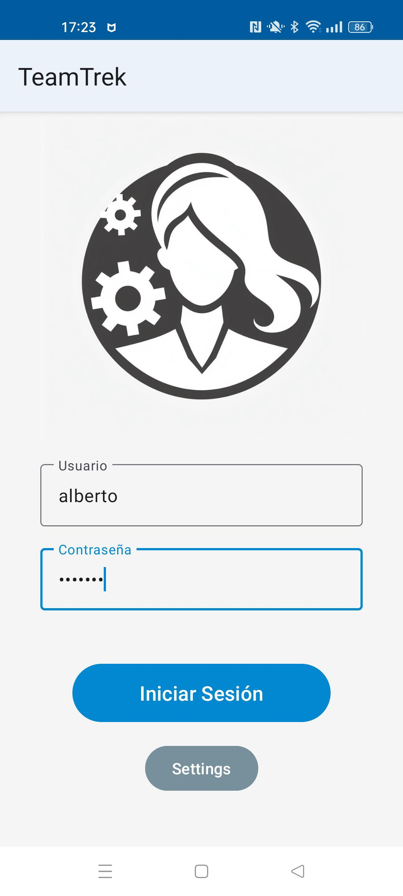
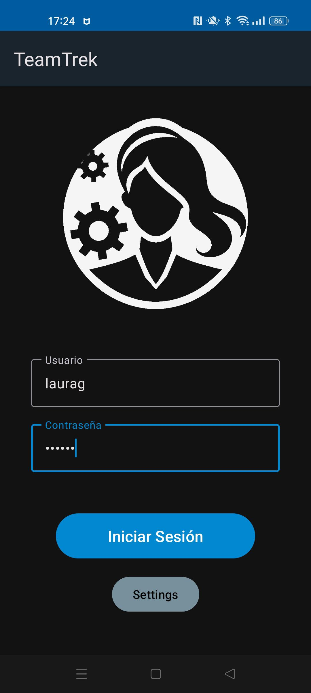
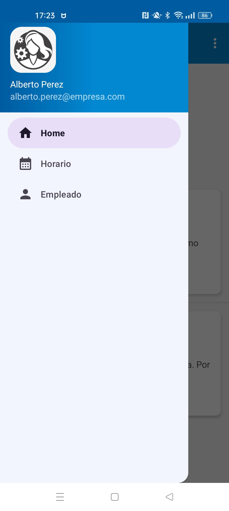
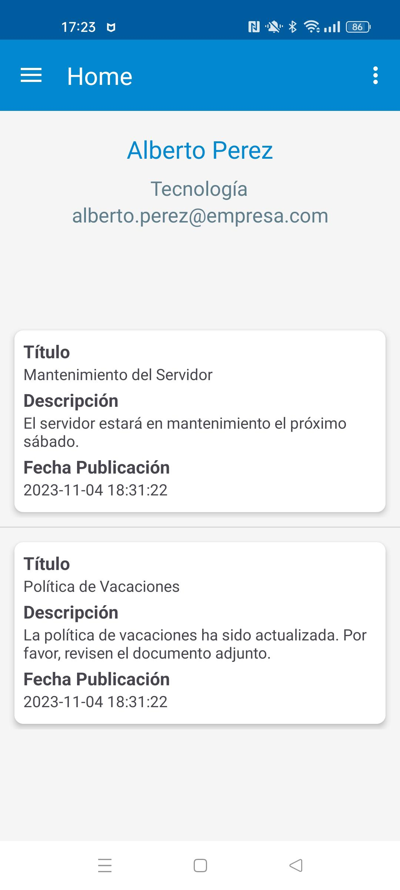
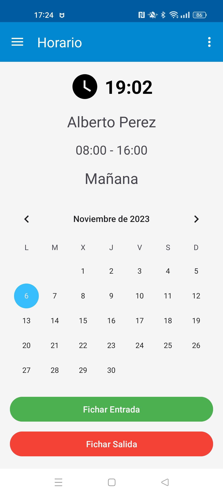
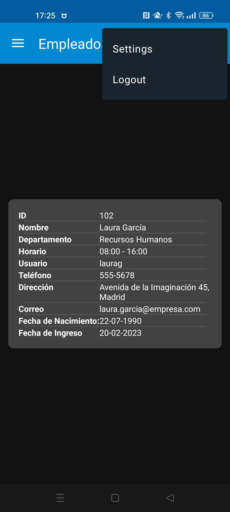
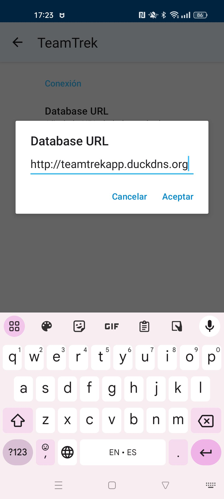
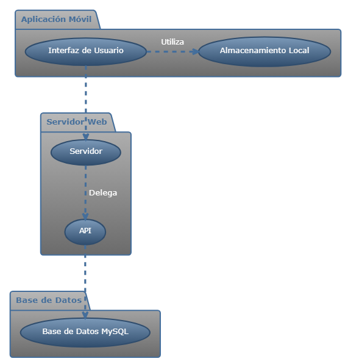
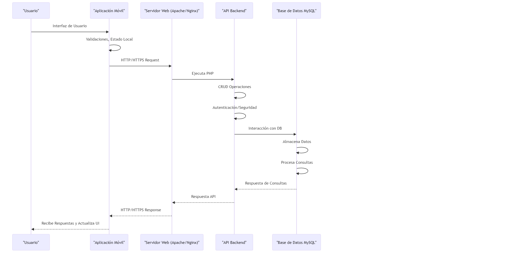

# TeamTrek: Aplicación de Gestión de Empleados (Proyecto en Desarrollo) ⚙️📱

**TeamTrek** es una aplicación móvil de código abierto para la gestión eficiente de trabajadores, diseñada específicamente para pequeñas y medianas empresas (PYMES). Desarrollada en Android SDK 30 y Java, TeamTrek ofrece una solución completa para la gestión de horarios, turnos de trabajo y comunicación interna. La aplicación se adhiere al diseño de Material Design 3, lo que garantiza una interfaz de usuario moderna y atractiva.

## Características Principales

1. **Inicio de Sesión de Usuarios y Administradores:** TeamTrek ofrece un sistema de inicio de sesión seguro tanto para los empleados como para los administradores. Los empleados pueden acceder a sus propios datos, mientras que los administradores tienen acceso a funcionalidades adicionales. ✔️

2. **Conectores PHP en el Servidor Web:** La aplicación se conecta a un servidor web que ejecuta scripts PHP para interactuar con una base de datos MySQL. Esto asegura que los datos estén disponibles y actualizados en tiempo real. ✔️

3. **Interfaz Responsive con Menú Lateral:** TeamTrek utiliza un diseño de interfaz de usuario responsive con un menú lateral desplegable (conocido como el menú de las tres rayas) mediante el uso de Fragmentos. Esto garantiza una experiencia de usuario fluida en una variedad de dispositivos Android y sigue los principios de Material Design 3. ✔️

4. **Fragmento de Bienvenida:** Al iniciar la aplicación, los usuarios son recibidos con un fragmento de bienvenida que muestra los avisos y anuncios importantes de la empresa. Esto permite a los empleados estar al tanto de las últimas novedades y sigue las pautas de Material Design 3 para una comunicación efectiva. 🌟

5. **Fragmento de Horarios:** TeamTrek permite a los empleados registrar su entrada y salida a través de la función de fichaje. Además, ofrece un calendario que muestra los turnos de trabajo y horarios, cumpliendo con las directrices de Material Design 3 en la presentación de información visual. ⏳

6. **Fragmento con Datos del Empleado:** Cada empleado puede acceder a su propio perfil, que contiene información personal y detalles de contacto. Esto asegura que los empleados siempre tengan acceso a su información actualizada de acuerdo con los estándares de Material Design 3. ⏳

7. **ViewModels para Cada Fragmento:** La arquitectura de TeamTrek utiliza ViewModels para cada Fragmento. Esto garantiza que las vistas se actualicen de manera eficiente y consistente a medida que cambian los datos, siguiendo las mejores prácticas de desarrollo de aplicaciones Android con Material Design 3. ⏳

8. **Configuración Personalizada:** La aplicación incluye una sección de configuración que permite a los usuarios ajustar la configuración del servidor y el token de acceso. Esto facilita la personalización de la aplicación según las necesidades individuales, manteniéndose en línea con las recomendaciones de Material Design 3 para una experiencia de usuario personalizada. ⏳

9.  **Roles de Usuarios:** TeamTrek implementa roles de usuario para garantizar distintos niveles de permisos. Los empleados normales pueden acceder y editar sus propios datos, mientras que los administradores pueden ver un listado completo de empleados, realizar modificaciones, eliminar registros o agregar nuevos empleados, siguiendo las normas de acceso y seguridad de Material Design 3. ⏳

10. **JSON web tokens (Próximamente):** Se está trabajando en la implementación de tokens de seguridad para validar y mantener la sesión. Por un lado, JSON web tokens para la validación de sesiones y un token de cabecera general para el acceso al de la app al servidor web. ⏳

11. **AppWeb - Acceso desde PC (Próximamente):** Se está trabajando en una versión web de TeamTrek que permitirá el acceso y la gestión de empleados desde PCs. Esto proporcionará aún más flexibilidad y accesibilidad a la aplicación. ⏳

## Estado del Proyecto

TeamTrek es un proyecto de código abierto en desarrollo activo. Actualmente, se están implementando las características mencionadas anteriormente, y se planea ampliar y mejorar la aplicación en cada nueva iteración de desarrollo. 🚀

## Requisitos del Sistema

Para que la aplicación funcione correctamente, es necesario disponer de un servidor web con una base de datos MySQL. Recomiendo utilizar una versión actualizada del software, como XAMPP (por ejemplo, xampp-x64-8.2.4-0-VS16). ⚙️🌐

## Instalación del entorno de pruebas

1. Clonar el repositorio https://github.com/k3ssdev/TeamTrekAndroid en Android Studio.

2. Configura el servidor web con una base de datos MySQL y asegúrate de que esté en funcionamiento.

3. Ajusta la configuración de la aplicación para que se conecte al servidor y proporcione el token de acceso necesario en la sección de Configuración.

4. Compila y ejecuta la aplicación en un dispositivo o emulador Android. 📲

## Resumen del Código

A continuación, se ofrece un resumen general del código y de la lógica empleada durante el desarrollo. Esto debería ayudar a los desarrolladores a familiarizarse con el código y a comprender mejor la estructura de la aplicación. 📝

- **LoginActivity**: Encargada del inicio de sesión del usuario, utilizando `DatabaseHandler` para verificar credenciales y manejar la navegación a otras actividades, como `SettingsActivity`.
- **MainActivity**: Suele ser el punto de entrada a la aplicación después del inicio de sesión, coordinando la navegación entre los diferentes fragmentos y la barra de menú lateral.
- **SettingsActivity** y **SettingsFragment**: Proporcionan interfaces para que los usuarios ajusten la configuración de la aplicación, como las URLs del servidor y los tokens de acceso, utilizando preferencias almacenadas en un archivo XML.
- **SharedViewModel**: Sirve como un contenedor de datos para compartir información entre fragmentos y actividades, lo que ayuda a mantener la información sincronizada y persistente frente a cambios de configuración.
- **DatabaseHandler**: Gestiona la interacción con la base de datos, realizando operaciones como consultas y actualizaciones de datos de empleados y avisos.
- **Empleado** y **EmployeeAdapter**: Definen la estructura de datos para los empleados y cómo se visualizan en la UI, usando un `ListView`.
- **Avisos** y **AvisosAdapter**: Similar a `Empleado` y `EmployeeAdapter`, pero para manejar avisos o anuncios dentro de la empresa.

Para cada uno de los fragmentos y modelos de vista adicionales (`CalendarFragment`, `CalendarViewModel`, `EmployeeFragment`, `EmployeeViewModel`, `HomeFragment`, `HomeViewModel`), cada uno maneja acciones específicas de la aplicación:

- **Fragmentos de Calendario y Empleado**: Estos fragmentos manejan la visualización y posiblemente la edición de horarios y la información de los empleados.
- **ViewModels**: Proporcionan una capa de abstracción para los datos que manejan los fragmentos, asegurando que los datos no se pierdan durante los cambios de configuración y facilitando la observación de cambios en los datos para actualizar la UI.

Aquí está el resumen de las clases y los métodos empoleados en cada fragmento y modelo de vista:

- **SettingsFragment**:
    - `onCreatePreferences()`: Método que carga las preferencias del usuario desde un recurso XML.
- **CalendarFragment**:
    - `onConsultaCompletada()`: Este método es un callback utilizado para manejar eventos después de que se completa una consulta contra la base de datos.
    - `onDestroyView()`: Método de ciclo de vida del fragmento que se llama cuando la vista creada por el fragmento está a punto de ser destruida.
- **CalendarViewModel**:
    - Sirve para observar los cambios en los datos de los horarios y actualizar la UI en consecuencia.
- **EmployeeFragment**:
    - `onConsultaCompletada()`: Similar al `CalendarFragment`, este método maneja el resultado de una consulta de los datos de empleados.
- **EmployeeViewModel**:
    - Sirve para observar los cambios en los datos de los empleados y actualizar la UI en consecuencia.
- **HomeFragment**:
    - `onDestroyView()`: Igual que en `CalendarFragment`, se encarga de la limpieza cuando la vista del fragmento está a punto de ser destruida.
- **HomeViewModel**:
    - Sirve para observar los cambios en los datos de los avisos y actualizar la UI en consecuencia.

Estos fragmentos y modelos de vista corresponden a diferentes secciones de la aplicación:

- **SettingsFragment**: Configuraciones de la aplicación.
- **CalendarFragment**: Manejo del calendario y horarios.
- **EmployeeFragment**: Información y gestión de empleados.
- **HomeFragment**: Pantalla de inicio o dashboard.

Los métodos `onConsultaCompletada` en `CalendarFragment` y `EmployeeFragment` realizan una consulta de datos que requiere manejo asíncrono (como la obtención de datos de un servidor o base de datos), y el método se llama cuando se completa esta operación.

Los métodos `onDestroyView` en `CalendarFragment` y `HomeFragment` son parte del manejo del ciclo de vida de los fragmentos y se usan para realizar cualquier limpieza necesaria antes de que la vista del fragmento sea destruida, como liberar recursos o detener animaciones.

Los `ViewModels` se utilizan para observar los cambios en los datos y actualizar la UI en consecuencia. Esto se hace mediante el uso de `LiveData`, que es un tipo de datos observable que se puede usar para almacenar y actualizar datos de manera eficiente. Los `ViewModels` se utilizan para almacenar los datos de los fragmentos y actividades, y se comunican con la base de datos a través de `DatabaseHandler` para realizar operaciones como consultas y actualizaciones.

En resumen, la lógica de la aplicación esta organizada en torno a los principios del diseño de Material Design y atendiendo a las buenas prácticas de Android, con una separación clara de la lógica de la interfaz de usuario y la lógica del negocio a través de la arquitectura de Fragmentos y ViewModels. 📝

## Arquitectura de la Aplicación y Secuencia de Datos

**Lado del Cliente (Aplicación Móvil):**

1. **Interfaz de Usuario (UI):**
    - La aplicación móvil presenta una interfaz de usuario donde los usuarios interactúan con la aplicación.
    - La UI recoge las entradas del usuario (credenciales de inicio de sesión, entradas/salidas, solicitudes de visualización de datos, etc.) y las envía al servidor.
2. **Procesamiento de la Lógica de Cliente:**
    - La aplicación puede tener una cierta lógica de negocio implementada en el cliente, como validaciones de entrada o manejo de estados locales.
3. **Comunicación con el Servidor:**
    - La aplicación móvil utiliza llamadas a la API (HTTP/HTTPS) para comunicarse con el servidor.
    - Envía y recibe datos en un formato estructurado, en este caso en XML.

**Lado del Servidor:**

1. **Servidor Web (Apache/Nginx con PHP):**
    - El servidor web recibe las solicitudes de la aplicación móvil.
    - PHP se ejecuta en el servidor web para manejar las solicitudes, ejecutar la lógica de negocio, interactuar con la base de datos MySQL, y preparar las respuestas.
2. **API de Backend:**
    - Una API de backend escrita en PHP que expone endpoints para las diferentes funciones que la aplicación móvil puede necesitar.
    - La API procesa las solicitudes, realiza operaciones CRUD (Crear, Leer, Actualizar, Eliminar) en la base de datos MySQL, y devuelve las respuestas.
3. **Base de Datos MySQL:**
    - MySQL almacena toda la información necesaria para la aplicación, como datos de usuario, horarios, registros de entrada/salida, etc.
    - El servidor PHP interactúa con la base de datos a través de extensiones como PDO o MySQLi.
4. **Autenticación y Seguridad:**
    - El servidor PHP maneja la autenticación de las solicitudes, asegurándose de que sean de usuarios legítimos.
    - Se implementan medidas de seguridad como encriptación de contraseñas, tokens de sesión, y protección contra ataques comunes (SQL Injection, Cross-Site Scripting, etc.).

**Comunicación:**

- La comunicación entre la aplicación móvil y el servidor se realiza a través de solicitudes HTTP/HTTPS.
- Los datos se envían y reciben en formato XML, que es ligero y fácil de manejar tanto en PHP como en la aplicación móvil.

**Flujo de Datos:**

1. El usuario inicia una acción en la aplicación móvil (por ejemplo, iniciar sesión).
2. La aplicación móvil envía una solicitud HTTP con los datos necesarios al servidor.
3. El servidor PHP recibe la solicitud y la procesa. Si es necesario, realiza una consulta a la base de datos MySQL.
4. La base de datos MySQL procesa la consulta y devuelve los resultados al servidor PHP.
5. El servidor PHP recibe los resultados de la base de datos, los procesa según sea necesario, y envía una respuesta de vuelta a la aplicación móvil.
6. La aplicación móvil recibe la respuesta y actualiza la UI en consecuencia.

**Seguridad:**

- Se utiliza HTTPS para asegurar que todas las comunicaciones entre la aplicación móvil y el servidor sean cifradas.
- Se implementan tokens de autenticación, como JWT (JSON Web Tokens), para gestionar sesiones y asegurar que las solicitudes sean autenticadas.

## Acerca del Autor

Mi nombre es Alberto Pérez, soy Administrador de Sistemas y estoy finalizando el GFGS de Desarrollo de Aplicaciones Multiplataforma. Me apasiona el desarrollo de software y la programación en general, además de la ciberseguridad y la administración de sistemas. 🖥️🔐

## Sobre el Proyecto

Esta aplicación se ha realizado como demostración para la asignatura de Proyecto de Desarrollo de Aplicaciones Multiplataforma. El objetivo es desarrollar una aplicación móvil que permita la gestión de empleados en una empresa, con un diseño moderno y atractivo. 📱

## Licencia

Este proyecto está bajo la Licencia MIT. Consulta el archivo [LICENSE](LICENSE) para obtener más información. 📜

